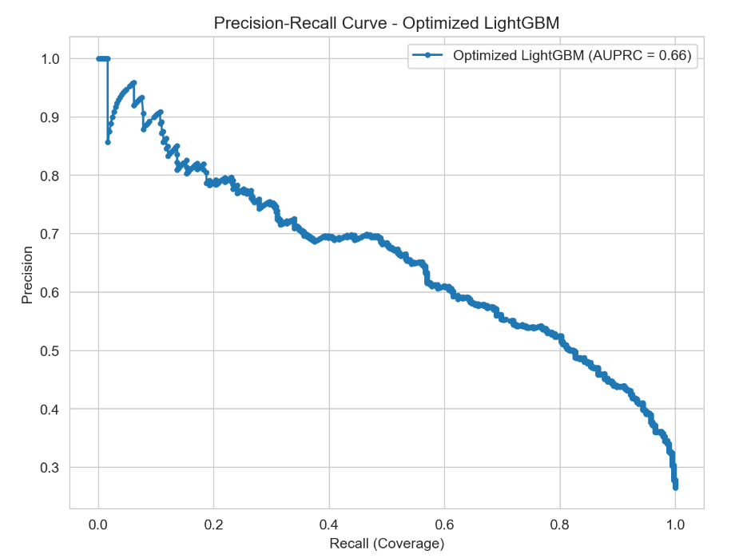

# Customer Churn Analysis and Prediction  

  

### ➡️ Full and Detailed Analysis in My Portfolio:  
[Access the full project page here](https://ferreiragabrielw.github.io/portfolio-gabriel/projetos/DataScience/2ChurnPrediction/ProjetoChurn.html)

### 🚀 Deployed:  
[Try the live app here](https://ds-churn-prediction-ml-deploy-qp3znuqfw4fpwqcv8li3n2.streamlit.app/)  

---

## About the Project  

This Data Science project focuses on predicting customer churn in a fictional telecommunications company. The dataset contains information from 7,043 customers in California during the third quarter, including demographics, services used, account information, billing, and whether the customer canceled their contract.  

The main objective is twofold:  
1. Predict churn (binary classification) using Machine Learning models.  
2. Interpret churn drivers to identify the main reasons behind customer attrition, enabling the company to develop proactive retention strategies.  

---

## Technologies and Process  

* Tools: Python (Pandas, Scikit-learn, LightGBM, XGBoost, Matplotlib, Seaborn), Quarto, Jupyter Notebook, Streamlit.  
* End-to-End Analysis Pipeline (E2E):  
    * Data Cleaning & Preparation:    
    * Exploratory Data Analysis (EDA):  
    * Feature Engineering & Encoding:  
    * Class Imbalance Handling:  
    * Modeling & Evaluation:  
    * Hyperparameter Optimization:  

* Key Insights (Business Perspective):  
    * High churn risk is associated with:  
        - Short tenure (customers within the first year).  
        - Month-to-month contracts.  
        - Electronic check payments.  
        - Lack of value-added services (tech support, online security).  
    * Strategic Recommendations:  
        - Strengthen onboarding in the first 6–9 months.  
        - Incentivize longer-term contracts with benefits/discounts.  
        - Address billing dissatisfaction (especially among high-paying customers).  
        - Bundle services to increase stickiness.  

---

## Repository Content  

* `Data/`: Contains the raw dataset (`dataset-churn.csv`).  
* `Notebooks/`: Includes the full analysis Jupyter Notebook (`.ipynb`) with all steps (EDA, preprocessing, modeling, interpretation).  
* `Quarto/`: Includes the `.qmd` source file of the report and its rendered HTML version.
* `Deploy/`: Includes the `app.py` source file of the live app and all the pkl files used. 
* `README.md`: This document.  
* `LICENSE`: Project license (MIT License).  

---

## How to View the Full Analysis  

* **Online (HTML)**: Download the `CustomerChurn.html` file from the `quarto/` folder and open it in your browser.  
* **Jupyter Notebook**: Explore the `.ipynb` in the `notebooks/` folder directly on GitHub or locally.  
* **Locally (Quarto)**:  
    1. Download the `CustomerChurn.qmd` file from the `quarto/` folder.  
    2. Install Quarto and Python with the required libraries.  
    3. Open the `.qmd` file in VS Code (with Quarto extension) and render it.  

---

### License  

This project is licensed under the [MIT License](LICENSE).  
